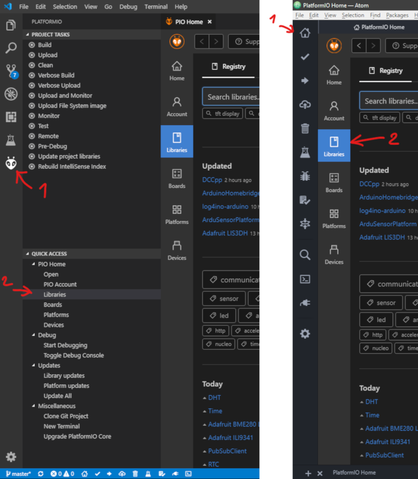
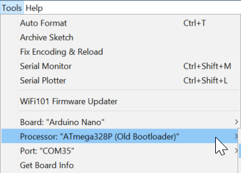

# MakerClock_ESP32
Is a standalone Branch of the **[FHNW Maker Clock - Arduino Software](https://github.com/FHNW-MakerStudio/MakerClockSoftware)**.
The main difference is that it uses 2 Boards to drive the Clock and give it more capabilities.

Boards used in this project:
* Arduino Nano with Uno Bootloader (Atmega Bootloaders for Nano will work too)
* Adafruit Espressif ESP32

Dependencies:
- Libraries:
  - RTCLib
  - Adafruit NeoPixel
  - Encoder
  - OneButton

## Contents
- [Installation](#installation)
  - [Arduino IDE](#arduino-ide)
  - [PlatformIO](#platformio)

## Installation:
### 1.1 Arduino IDE 
Please refer to Installation in [FHNW Maker Clock - Arduino Software](https://github.com/FHNW-MakerStudio/MakerClockSoftware#installation) for the regular Arduino IDE.
> The instructions are in German but have complementary images to it.
> If you feel that you need to read the instructions, you can simply translate it.
> I recommend using [DeepL](https://www.deepl.com/en/translator) as translator.
> It is better as Google translator because it uses deep learning for contextual translation.

After installation you must install Adafruit Espressif ESP32 board described here: [Adafruit HUZZAH32 - ESP32 Feather Guide](https://learn.adafruit.com/adafruit-huzzah32-esp32-feather/using-with-arduino-ide)
After all that you are set for **[testing the IDE](#test-your-ide-installation)**
### 1.2 PlatformIO 
PlatformIO is an open source ecosystem for IoT development and a free Arduino IDE alternative. It supports +600 embedded boards and is Cross-platform IDE.
For more Information please visit [platformio.org](https://platformio.org)

#### Installation instructions:
1. Visit [platformio.org/platformio-ide](https://platformio.org/platformio-ide)
2. Choose your prefferd Editor: [Atom](https://platformio.org/install/ide?install=atom) or [VSCode](https://platformio.org/install/ide?install=vscode)
3. Go throw the install steps of the Editor of your choice and install PlatformIO
4. After PltformIO has been successfully installed on your Editor, go to Libraries tab of it and search and install all dependencies:
	4. Atom: navigate to home button top on the left panel -> Libraries in the opened tab
	4. VSCode: navigate to PlatformIO symbol on the left panel -> in quick access just beside left panel Libraries

5. You are all set for **[testing the IDE](#test-your-ide-installation)**

### Test your IDE Installation
#### Arduino:
1. Open the Arduino file [ArduinoMakerClock60.ino](MakerClock_Arduino/ArduinoMakerClock60.ino) in the folder [MakerClock_Arduino](MakerClock_Arduino/)
2. Set your target board (either Nano or Uno) and processor

3. Click the verify button top left 
4. The terminal at the bottom should indicate that it compiled the code successfully after a few seconds.
5. You are ready to get started!
#### PatformIO:
1. On the home screen click `Open Project`
2. Navigate to the folder where you have cloned or downloaded and unpacked this project and select the folder `MakerClock_Nano`.
3. In the IDEs explorer open `main.cc` under the `src` folder.
4. Build the project:

VSCode | Atom
---------- | -------
[VSCode_build](images/VSCode_build.png) | [Atom_build](images/Atom_build.png)
5. The terminal at the bottom should indicate that it compiled the code successfully after a few seconds.
6. You are ready to get started!
