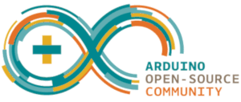
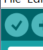

# MakerClock_ESP32
Is a standalone Branch of the **[FHNW Maker Clock - Arduino Software](https://github.com/FHNW-MakerStudio/MakerClockSoftware)**.
The main difference is that it uses 2 Boards to drive the Clock and give it more capabilities.

#### Boards used in this project:
* Arduino Nano with Uno Bootloader (Atmega Bootloaders for Nano will work too)
* Adafruit Espressif ESP32

#### Dependencies:
- Libraries:
  - `RTCLib` by Adafruit
  - `Adafruit NeoPixel` by Adafruit
  - `Encoder` by Paul Stoffregen
  - `OneButton` by Matthias Hertel

## Contents
- [Installation](#installation)
  - [Arduino IDE](#11-arduino-ide)
  - [PlatformIO](#12-platformio)
- [Test your IDE Installation](#test-your-ide-installation)
  - [Arduino](#arduino)
  - [PatformIO](#platformio)
- [Connecting to your Board](#connecting-to-your-board)
- [Troubleshooting](#troubleshooting)
- [Authors](#authors)
- [License](#license)
- [Acknowledgments](#acknowledgments)

## Installation:
### 1.1 Arduino IDE

Please refer to Installation in [FHNW Maker Clock - Arduino Software](https://github.com/FHNW-MakerStudio/MakerClockSoftware#installation) for the regular Arduino IDE.
> The instructions are in German but have complementary images to it.
> If you feel that you need to read the instructions, you can simply translate it.
> I recommend using [DeepL](https://www.deepl.com/en/translator) as translator.
> It is better as Google translator because it uses deep learning for contextual translation.

After installation you must install Adafruit Espressif ESP32 board described here: [Adafruit HUZZAH32 - ESP32 Feather Guide](https://learn.adafruit.com/adafruit-huzzah32-esp32-feather/using-with-arduino-ide)
After all that you are set for **[testing the IDE](#test-your-ide-installation)**
### 1.2 PlatformIO

PlatformIO is an open source ecosystem for IoT development and a free Arduino IDE alternative. It supports +600 embedded boards and is Cross-platform IDE.
For more Information please visit [platformio.org](https://platformio.org)

#### Installation instructions:
1. Visit [platformio.org/platformio-ide](https://platformio.org/platformio-ide)
2. Choose your prefferd Editor: [Atom](https://platformio.org/install/ide?install=atom) or [VSCode](https://platformio.org/install/ide?install=vscode)
3. Go throw the install steps of the Editor of your choice and install PlatformIO
4. After PltformIO has been successfully installed on your Editor, go to Libraries tab of it and search and install all [dependencies](#dependencies):
	1. **Atom**: navigate to `home` button top on the left panel > `Libraries` in the opened tab
	2. **VSCode**: navigate to `PlatformIO symbol` on the left panel > in quick access just beside left panel `Libraries`

5. You are all set for **[testing the IDE](#test-your-ide-installation)**

### Test your IDE Installation
#### Arduino:
1. Open the Arduino file [ArduinoMakerClock60.ino](MakerClock_Arduino/ArduinoMakerClock60.ino) in the folder [MakerClock_Arduino](MakerClock_Arduino/)
2. Set your target board (either Nano or Uno) and processor

3. Click the verify button top left 

4. The terminal at the bottom should indicate that it compiled the code successfully after a few seconds.
5. You are ready to get started!
#### PatformIO:
1. On the home screen click `Open Project`

2. Navigate to the folder where you have cloned or downloaded and unpacked this project and select the folder `MakerClock_Nano`.
3. In the IDEs explorer open `main.cpp` under the `src` folder.
4. Build the project:

VSCode | Atom
------ | -------
[VSCode build](images/VSCode_build.png) | [Atom build](images/Atom_build.png)
5. The terminal at the bottom should indicate that it compiled the code successfully after a few seconds.
6. You are ready to get started!

## Connecting to your Board
For the Arduino please refer to the section [Programming](https://github.com/FHNW-MakerStudio/MakerClockSoftware#3-programmierung) of MakerStudio/MakerClockSoftware.

PlatformIO automatically detects your board and sets the correct COM Ports when you press upload.

**Note there are different types of build, clean and upload!**

**VSCode:**

**Atom:**

## Troubleshooting
This is a list of most common mistakes that could happen while preparing your IDE.

Problem | Possible solution
------- | -----------------
The code doesn't compile/has errors | Check the error, most of the times it is because a [dependency](#dependencies) is missing like a library. After installing the missing component it is recommended to restart the IDE that it can load all
Wrong COM port selected | check your comport setting in the Arduino IDE under tools
Missing drivers | Open Device Manager and update drivers
Wrong Arduino selected | Depending on which Bootloader your board is running on, choose the right one. Arduino Nano has 3 different ones, just try one after each other
USB problem on Mac OS X | sometimes a USB hub between the Mac and Arduino can help

## Authors
* **[YD95](https://github.com/YD95)** - _Initial Branch creator_ - [Devlobsters](https://github.com/devlobsters)

## License
This project is licensed under the MIT License - see the [LICENSE](LICENSE) file for details

## Acknowledgments
* Thanks to Simon Burkhardt ([mnemocron](https://github.com/mnemocron)) from [FHNW MakerStudio](https://github.com/fhnw-makerstudio) for letting me reffer to their Github site
